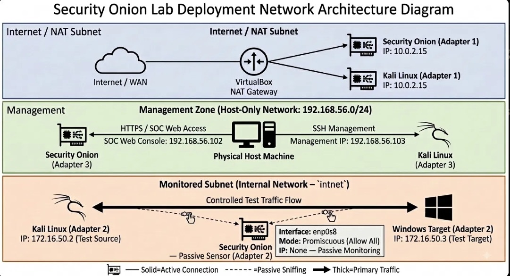
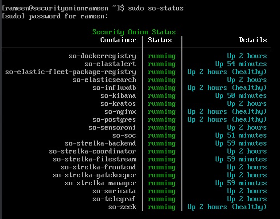
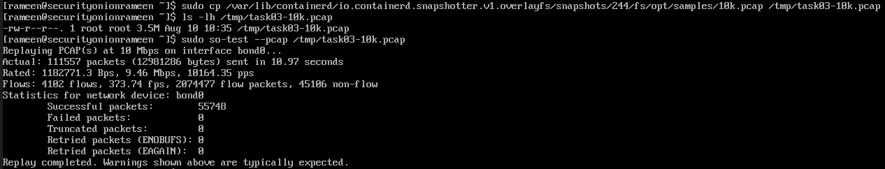

# Architecture & Setup Notes

## Objective

Deploy a Security Onion Evaluation environment and configure it for network security monitoring, threat hunting, and incident response.

---

# Lab Environment

| Component              | Details                    |
|------------------------|----------------------------|
| Host Operating System  | Windows 11                 |
| Hypervisor             | Oracle VirtualBox 7.2.12   |
| Security Onion Version | 3.2.0                      |
| Deployment Mode        | Evaluation                 |
| Virtual CPUs           | 4                          |
| RAM                    | 16 GB                      |
| Storage                | 200 GB (Dynamic VDI)       |
| Test Machine           | Kali Linux and Windows VM  |

---

> # Lab Architecture

Although this lab was deployed in **Evaluation Mode**, Security Onion supports multiple node types for distributed deployments.

| Node Type    | Purpose                                                                                                               |
|--------------|-----------------------------------------------------------------------------------------------------------------------|
| Manager      | Central management node responsible for configuration, user management, playbooks, and overall administration.        |
| Search       | Stores and indexes security data using Elasticsearch, allowing analysts to search logs and alerts efficiently.        |
| Forward      | Collects logs from sensors and forwards them to the Search node for processing and storage.                           |
| Sensor / IDS | Monitors network traffic, captures packets, and generates security events using tools such as Zeek and Suricata.      |

In this lab, all of these roles were combined into a **single Evaluation node**, allowing the complete Security Onion platform to run within one virtual machine.

---

# Installation Summary

The Security Onion platform was deployed in **Evaluation Mode** using Oracle VirtualBox on a Windows 11 host system. A virtual machine was created with the required hardware resources and booted using the official Security Onion ISO image.

The installation was completed through the Security Onion setup wizard, where the Evaluation deployment option was selected. This deployment mode installs the core Security Onion components within a single virtual machine, making it suitable for learning, testing, and feature exploration.

After the installation and initial system configuration were completed, the platform initialized its services. The deployment was verified to ensure that the Security Onion environment was operational and ready for further configuration, data ingestion, and feature exploration.

---

# Network Configuration

The Security Onion lab was deployed using Oracle VirtualBox on a Windows 11 host system. The environment consists of one Security Onion Evaluation virtual machine, one Kali Linux virtual machine, and one Windows 11 target virtual machine.

### IP Addressing & Interface Mapping

| Machine            | Adapter 1 — NAT        | Adapter 2 — Internal Network (`intnet`)| Adapter 3 — Host-Only (`192.168.56.0/24`) |
|--------------------|------------------------|----------------------------------------|-------------------------------------------|
| **Security Onion** | `10.0.2.15` (`enp0s3`) | `enp0s8` → No IP (Promiscuous)         | `192.168.56.102` (`enp0s9`)               |
| **Kali Linux**     | `10.0.2.15`            | `172.16.50.2`                          | `192.168.56.103`                          |
| **Windows Target** | `192.168.100.185`      | `172.16.50.3`                          | Assigned Host-Only IP                     |

---

### Interface Roles

- **Adapter 1 (NAT):** Provides outbound Internet access for downloading Security Onion updates, threat intelligence feeds, container images, and rule updates.
- **Adapter 2 (Internal Network – `intnet`):** Configured in **Promiscuous Mode (Allow All)** to passively capture network traffic generated between Kali Linux (`172.16.50.2`) and the Windows target (`172.16.50.3`). The Security Onion monitoring interface (`enp0s8`) has no assigned IP address to ensure pure passive packet capture.
- **Adapter 3 (Host-Only Network – `192.168.56.0/24`):** Dedicated management network used to access the Security Onion SOC web interface, Kibana, and management services from the Windows host (`192.168.56.1`) at `192.168.56.102`.

The Kali Linux and Windows virtual machines generate test traffic across the internal network (`172.16.50.0/24`), while Security Onion passively inspects the traffic through `enp0s8` via Zeek and Suricata.

## Network Diagram



---

# Service Verification

After the installation and initial configuration were completed, the status of all Security Onion services was verified using the following command:

```bash
sudo so-status
```

The output confirmed that all required Security Onion services were running successfully, indicating that the deployment had completed successfully and the platform was ready for use.

## Verification Screenshot




---
# Data Ingestion

A sample PCAP provided with the Security Onion environment was used to test the data-ingestion pipeline.

The PCAP file was staged on the Security Onion VM at:

```text
/tmp/task03-10k.pcap
```

The PCAP was replayed using the Security Onion so-test utility:

```Bash
sudo so-test --pcap /tmp/task03-10k.pcap

```
The replayed packets were processed by Security Onion and analyzed by Zeek. Zeek generated network connection metadata from the traffic, which was ingested into Security Onion and made available through the Hunt interface.


The PCAP replay completed successfully.

**Hunt Verification**
After replaying the PCAP, the generated Zeek connection data was searched in the Hunt interface using the following query:

**Plaintext**
event.dataset: zeek.conn
The search returned the corresponding zeek.conn events generated from the replayed PCAP.

**Sample Event**
The successful appearance of the zeek.conn event in Hunt confirmed that the Security Onion sample PCAP was successfully replayed, processed by Zeek, and ingested into Security Onion.

---

# Installation Challenges

During the deployment and initial configuration of the Security Onion Evaluation environment, several technical challenges were encountered and successfully resolved.

---

### Host-Only Web Interface Inaccessible (Firewall Blocking & Syntax Errors)

**Problem:**  
Attempts to access the SOC Web Interface (`https://192.168.56.102`) from the Windows 11 host browser were blocked. Running `sudo so-allow` directed the session to use `so-firewall`, but initial CLI commands failed with usage errors (`ERROR - Usage: /sbin/so-firewall [OPTIONS] <COMMAND> [ARGS...]`).

**Root Cause:**  
1. Security Onion enforces strict default firewall rules that drop incoming management traffic from unrecognized IP addresses.
2. The `so-firewall` utility requires exact action keywords (`includehost`) rather than generic verbs (`add`). Including both `includehost` and `add` in the command caused command-parsing errors.

**Remediation:**  
1. Identified correct CLI usage options using `sudo so-firewall help`.
2. Executed the correct command syntax to whitelist the Host-Only network subnet (`192.168.56.0/24`) for the `analyst` group and applied the rules immediately:
   ```bash
   sudo so-firewall includehost analyst 192.168.56.0/24 --apply

### Network Interface and IP Configuration Issues

**Problem:**
Communication between the Kali VM, Windows VM, and Security Onion initially required troubleshooting because the virtual machines used different VirtualBox network interfaces and subnets.

**Root Cause:**
The Security Onion VM used multiple VirtualBox adapters for different purposes, including NAT, Host-Only, and the internal monitoring network. Incorrect interface selection or IP configuration could prevent the test machines from communicating or prevent Security Onion from seeing the expected traffic.

**Remediation:**

Checked the interfaces and assigned addresses using:

ip addr
Verified connectivity between the lab machines using ping.
Confirmed the intended lab addresses:
Kali: 172.16.50.2
Windows: 172.16.50.3
Verified that the Security Onion monitoring interface was connected to the appropriate network.

**Lesson Learned:**
Network configuration should be verified before troubleshooting Security Onion applications. Knowing which interface is used for management and which interface receives monitored traffic is essential.

## Hunt Initially Returned No Results

**Problem:**
Initial searches in the Hunt interface returned zero events even though Zeek and Suricata were expected to generate network telemetry.

**Root Cause:**
The required test traffic had not yet been generated/replayed through the monitoring pipeline, and time-range selection also affected which events were visible.

**Remediation:**

Generated controlled network traffic from the lab machines.

Replayed the sample PCAP using:

sudo so-test --pcap /tmp/task03-10k.pcap
Checked the Hunt time range and adjusted it to include the event timestamps.
Verified that Zeek events subsequently appeared in Hunt.

**Lesson Learned:**
A Hunt query returning zero results does not necessarily indicate a broken Hunt interface. The analyst should first verify that traffic was captured, processed, indexed, and falls within the selected time range.

## Lessons Learned

During the Security Onion  deployment and feature exploration, several practical challenges were encountered. These issues helped build a better understanding of Security Onion's architecture, resource requirements, network configuration, and investigation workflow.

### 1. Resource Requirements Matter

Security Onion is resource-intensive because multiple services such as Elasticsearch, Zeek, Suricata, Fleet, and other supporting containers run simultaneously. Insufficient CPU or memory can cause services to become degraded or unresponsive.

**Lesson:** Allocate sufficient RAM, CPU cores, and disk space before beginning the deployment. Monitor resource usage with `so-status` and investigate high memory or CPU utilization when troubleshooting.

### 2. Network Interface Configuration Is Critical

The lab required multiple VirtualBox network interfaces for management, host communication, and monitored traffic. Correctly assigning the interfaces and IP addresses was essential for communication between Kali, Windows, and Security Onion.

**Lesson:** Verify the IP addresses and interface assignments on every VM before troubleshooting higher-level Security Onion features. Network connectivity should be confirmed with tools such as `ip addr`, `ping`, and connection tests before investigating the SIEM.

### 3. Traffic Must Actually Reach the Sensor

Initially, some Hunt searches returned no results because the expected network telemetry had not yet been generated or ingested. Replaying a sample PCAP with `so-test` successfully generated traffic and caused Zeek events to appear in Hunt.

**Lesson:** When Hunt returns no results, first confirm that traffic is reaching the monitoring interface and that the required sensors are processing it. A valid query alone does not guarantee results if no corresponding telemetry exists.

### 4. Time Range Affects Hunt Results

Security Onion Hunt uses a configurable time range. Events may appear to be missing when the search window does not include the timestamp of the generated traffic.

**Lesson:** Always check the Hunt time picker and use a narrow time range around the known event timestamp when investigating a specific alert.

### 5. Zeek and Suricata Provide Different Types of Visibility

The lab demonstrated that Suricata is particularly useful for signature-based detection, while Zeek provides detailed network metadata such as connections, DNS activity, and HTTP transactions.

**Lesson:** A Suricata alert should not be investigated in isolation. Pivoting into Zeek logs provides additional context, while PCAP provides packet-level confirmation.

### 6. PCAP Provides the Strongest Packet-Level Evidence

The HTTP investigation showed how an alert could be correlated with the underlying TCP session. The PCAP confirmed the TCP handshake, HTTP GET request, custom User-Agent, server response, and connection termination.

**Lesson:** When an alert requires deeper validation, extracting and examining the associated PCAP can confirm exactly what occurred on the network.

### 7. Custom Detection Rules Require Controlled Testing

Custom Suricata rules were validated by generating known, benign traffic from Kali, including an ICMP payload containing `LABPING` and an HTTP request containing `SOC-TEST-AGENT`.

**Lesson:** Detection rules should be tested with predictable traffic so that analysts can verify that the rule triggers correctly and understand exactly which network behavior caused the alert.

### 8. Overrides Help Reduce Alert Noise

The default `GPL ICMP PING *NIX` detection generated repeated alerts during testing. A source-based Suppress override was created for the Kali lab IP address.

**Lesson:** Overrides can reduce false-positive or noisy alerts without disabling the underlying detection globally. Tuning should be scoped carefully so that legitimate alerts from other sources remain visible.

### 9. Evaluation Mode Has Feature Limitations

Some features could not be fully explored because the Security Onion installation was running in Evaluation Mode. In particular, external endpoint enrollment and certain administrative capabilities were restricted.

**Lesson:** Feature availability depends on the Security Onion deployment mode and licensing. When a feature cannot be exercised, the limitation should be documented rather than assuming the feature is unavailable in Security Onion generally.

### 10. Case Management Completes the Investigation Workflow

The case investigation demonstrated the complete workflow:

**Alert → Hunt → Pivot → PCAP → Evidence → Observables → Investigation Notes → Closure**

The final case documented that the HTTP activity was intentionally generated lab traffic and that no malicious activity was identified.

**Lesson:** Case Management provides an important record of the investigation and makes the final analyst decision and supporting evidence available to other team members.

### Overall Lesson

The main lesson from the exercise was that Security Onion is most effective when its components are used together. **Suricata identifies suspicious traffic, Zeek provides network context, Hunt correlates events, PCAP provides packet-level evidence, Playbooks structure the investigation, and Cases document the final outcome.**

A successful SOC investigation therefore follows a repeatable process rather than relying on a single alert or tool.
