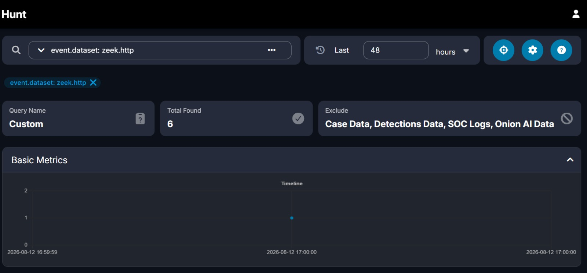
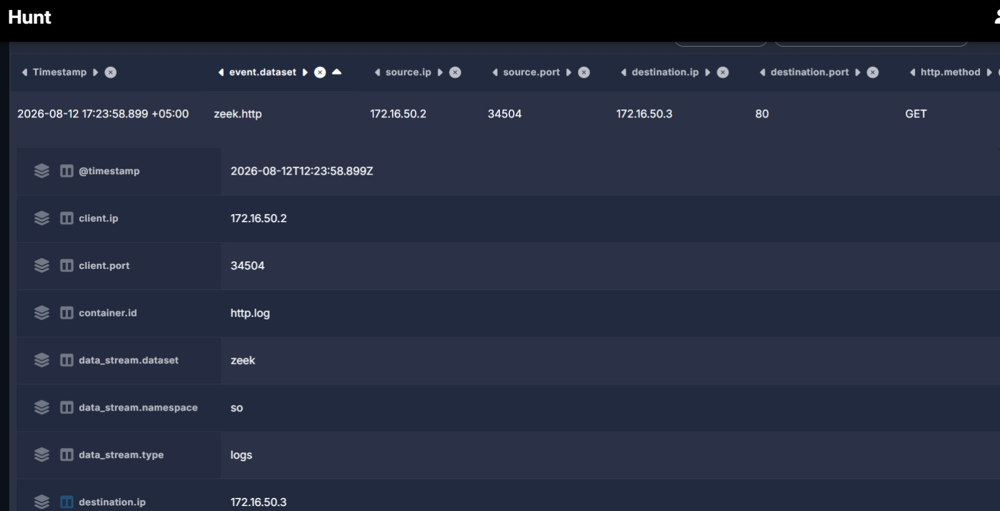
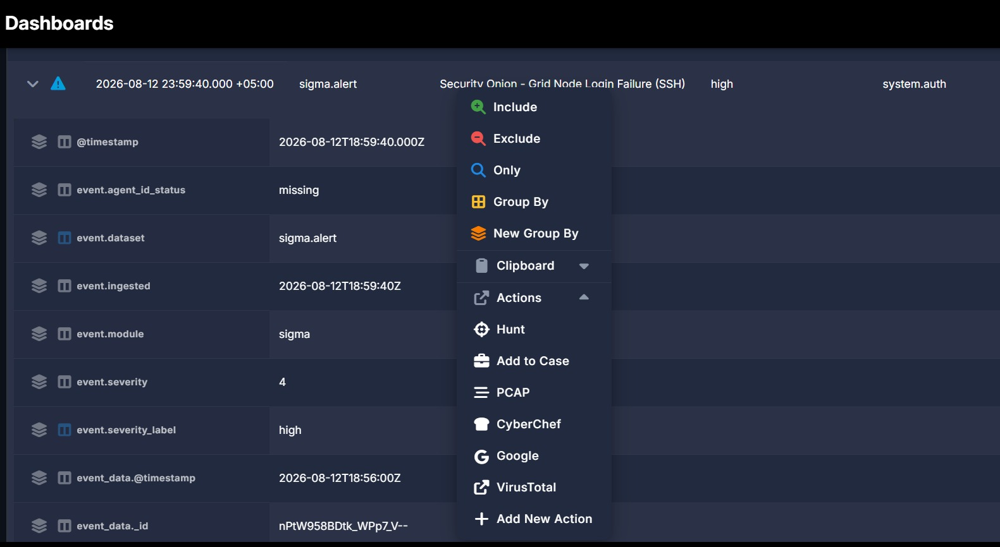
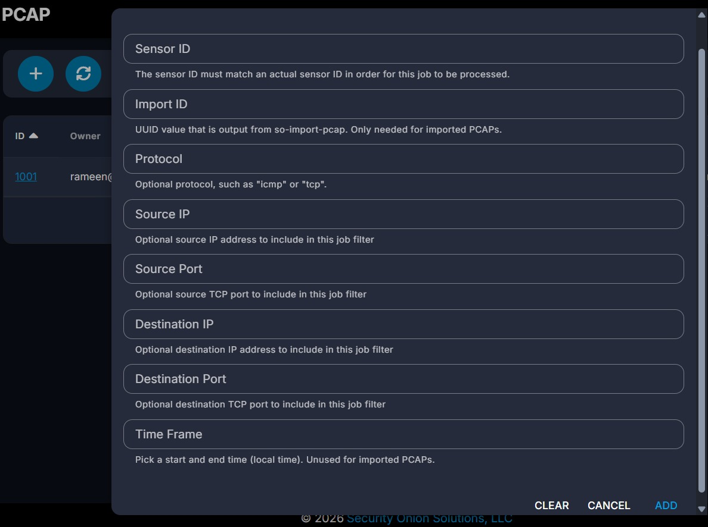
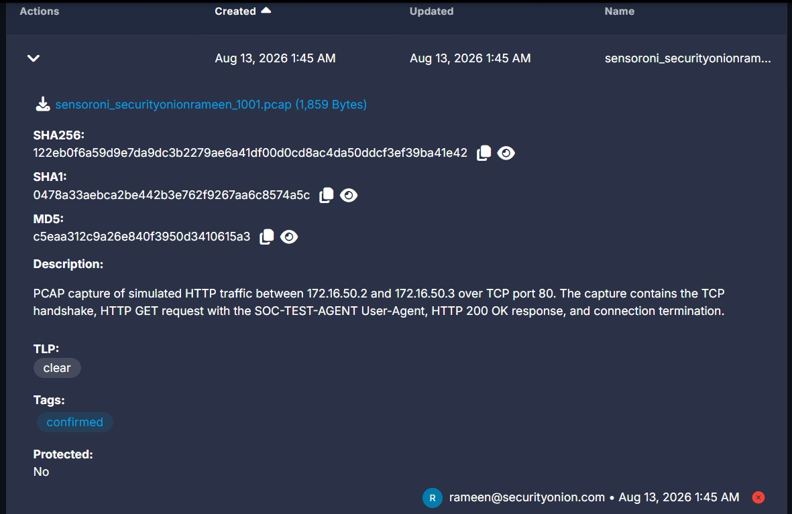

# Security Onion — Core Features Cheat Sheet

> **Quick Reference for Tier 1 Analysts**
> Node: `securityonionrameen` | SO Version: 3.2.0
> For full context see: [Feature Explorer's Guide](./feature-explorers-guide.md)

---

## 1. Searching in Hunt

Hunt is the primary threat hunting and log search interface in Security Onion.
Access it from the SOC sidebar → **Hunt**

### Step 1 — Write Your Query

Type your query in the search bar at the top. Basic syntax:

field: value
field: value AND field2: value2

**Most useful starting queries:**

| What you want to find     | Query                                                           |
|---------------------------|-----------------------------------------------------------------|
| All Suricata alerts       | `event.dataset: suricata.alert`                                 |
| All Zeek connections      | `event.dataset: zeek.conn`                                      |
| All DNS activity          | `event.dataset: zeek.dns`                                       |
| All HTTP activity         | `event.dataset: zeek.http`                                      |
| Alerts from a specific IP | `event.dataset: suricata.alert AND source.ip: 172.16.50.2`      |
| Alerts to a specific IP   | `event.dataset: suricata.alert AND destination.ip: 172.16.50.3` |
| Find a specific rule      | `rule.name: "CUSTOM LAB HTTP USER AGENT"`                       |
| All traffic for a host    | `source.ip: 172.16.50.2 OR destination.ip: 172.16.50.2`         |
| High severity alerts      | `event.severity_label: high`                                    |

**Screenshot:**

---

### Step 2 — Set Your Time Range

- Default is **Last 24 hours** — adjust in the top-right time picker
- For a specific event: set a tight window around the known timestamp to reduce noise

---

### Step 3 — Read the Results

Hunt returns two sections:

- **Basic Metrics** — a timeline chart showing event volume over time
- **Events table** — each row is one log entry with fields: Timestamp, event.dataset, source.ip, source.port, destination.ip, destination.port, rule.name

Click any **row** to expand and see all fields for that event.

**Screenshot:**

---

### Step 4 — Pivot from a Result

From any expanded event row you can:
- Click the **PCAP** icon → jump directly to packet capture for that session
- Click the **Case** icon → attach this event to an open case

---

## 2. Extracting a PCAP

PCAP gives you the raw packet-level evidence behind any alert.
Access it from the SOC sidebar → **PCAP** or directly from dashboard event row.

### Method A — From dashboard Event row (Fastest)

1. Run your  query and find the  event
2. Click the event row to expand it
3. Look for the **PCAP** icon in the action buttons
4. Click it — SO automatically scopes the PCAP job to that session's source IP, destination IP, port, and timeframe
5. Wait for the job to complete → click **View**

**Screenshot:**

---

### Method B — From the PCAP Page (Manual)

1. Go to **PCAP** in the SOC sidebar
2. Fill in the filter fields
3. Click **Submit Job**
4. The job appears in the queue — wait for status to show complete
5. Click **View** to open the built-in packet viewer

**Screenshot:**

---

### Step 3 — Read the PCAP Viewer

The built-in viewer shows each packet as a row:

| Column                | What it tells you              |
|-----------------------|--------------------------------|
| Num                   | Packet sequence number         |
| Timestamp             | Exact time of packet           |
| Type                  | Protocol (TCP / UDP / ICMP)    |
| Source IP / Port      | Who sent it                    |
| Destination IP / Port | Who received it                |
| Flags                 | TCP state (SYN, ACK, PSH, FIN) |
| Length                | Packet size in bytes           |

**What a normal HTTP session looks like:**
0 → SYN (client opens connection)
1 ← SYN ACK (server accepts)
2 → ACK (handshake complete)
3 → PSH ACK (client sends HTTP GET request)
4 ← ACK (server acknowledges)
5 ← PSH ACK (server sends HTTP response)
6 → ACK (client acknowledges)
7 → FIN ACK (client closes connection)
8 ← FIN ACK (server closes connection)
9 → ACK (done)

**Screenshot:**

--- 

---

## 3. Creating a Case

Cases are Security Onion's built-in investigation tracker.
Access from the SOC sidebar → **Cases** → click **+**

---

### Step 1 — Open the Case

Fill in the initial fields:

| Field       | What to write                                                               |
|-------------|-----------------------------------------------------------------------------|
| Title       | Short descriptive name — e.g. `Suspicious HTTP User-Agent from 172.16.50.2` |
| Description | 2–3 sentences: what fired, what IPs, what the initial hypothesis is         |
| Severity    | low / medium / high / critical                                              |
| Status      | Open                                                                        |

Click **Save**.

---

### Step 2 — Attach Evidence (Attachments Tab)

Click **Attachments** → **+** → upload your PCAP file or screenshots.

For each attachment fill in:

| Field           | Example                                                         |
|-----------------|-----------------------------------------------------------------|
| Description     | `PCAP of HTTP session from 172.16.50.2:53728 to 172.16.50.3:80` |
| TLP             | `clear` (lab) or `amber` (internal only)                        |
| Tags            | `confirmed`, `pcap`, `evidence`                                 |

The UI will auto-calculate **SHA256, SHA1, MD5** hashes for file integrity.

**Screenshot:**

---

### Step 3 — Log Observables (Observables Tab)

Observables are the structured IOCs (Indicators of Compromise) tied to this case.

Click **Observables** → **+** → add each one:

| Type | Value | Example use |
|------|-------|-------------|
| `ip` | `172.16.50.2` | Source attacker IP |
| `ip` | `172.16.50.3` | Destination victim IP |
| `other` | `80` | Destination port |
| `user-agent` | `SOC-TEST-AGENT` | Suspicious User-Agent |
| `url` | `http://172.16.50.3/` | Requested URL |

**Screenshot:**

---

### Step 4 — Link the Alert Event (Events Tab)

Click **Events** → **+** → paste the event ID from the Hunt result.

This links the raw Suricata/Zeek log entry directly to the case so anyone reading it can jump straight to the original alert.

**Screenshot:**

---

---

### Step 5 — Close the Case

When investigation is complete:

1. Add a final **closure comment** summarising:
   - What the alert was
   - What evidence was collected
   - Final verdict (true positive / false positive / benign)
2. Change **Status** → **Closed**
3. Save

Final verdict: Benign simulated test activity. The CUSTOM LAB HTTP USER AGENT Suricata alert was triggered by the controlled HTTP request from 172.16.50.2 to 172.16.50.3:80 using the SOC-TEST-AGENT User-Agent. PCAP analysis confirmed the TCP handshake, HTTP GET request, HTTP 200 OK response, and connection termination. The PCAP was attached as evidence and relevant IP, port, User-Agent, and alert information were documented. No malicious activity was identified. Case closed.

**Screenshot:**

---

## Quick Decision Tree — What to Open First?
Alert fires in SO  
│  
▼  
Open HUNT  
Search: `rule.name:"<alert name>"`  
│  
├── Who is the source IP?  
│   Search: `source.ip:X OR destination.ip:X`  
│   → Any other alerts on this host?  
│  
├── What did they do?  
│   `event.dataset: zeek.http` → check User-Agent, URI  
│   `event.dataset: zeek.dns` → check what domains they resolved  
│   `event.dataset: zeek.conn` → check all connections, bytes, duration  
│  
├── Pull the PCAP  
│   → Confirm what the alert actually saw at packet level  
│  
└── Open a CASE  
    → Attach PCAP  
    → Add observables  
    → Link alert event  
    → Document findings  
    → Close with verdict

---