# Security Onion Feature Explorer's Guide
> **Prerequisite Reading:** 
**[Lab System Architecture Document](./Architecture-Setup.md)**
**[Cheat sheet Document](./Cheat-Sheet.md)**
---

## 1. Executive Summary & Scope

This guide serves as a practical, hands-on reference for team members navigating and evaluating **Security Onion** on node `securityonionrameen`. It details data ingestion workflows, functional differences between Network Security Monitoring (NSM) engines (**Zeek** vs. **Suricata**), and step-by-step query procedures in the **Hunt** console.

### 1.1 Lab Testbed Quick Reference

| Role                   | Hostname / Node       | IP Address      | Primary Function                                          |
| :----------------------|-----------------------|-----------------|-----------------------------------------------------------|
| **Attacker Machine**   | `kali`                | `172.16.50.2`   | Traffic generation & attack simulation                    |
| **Target / Victim**    | `Windows VM`          | `172.16.50.3`   | Target endpoint, Sysmon, Windows Event Logs, Elastic Agent|
| **Sensor / SIEM**      | `securityonionrameen` | `192.168.56.102`| Ingestion, Suricata/Zeek parsing, Elastic Search, Hunt UI |
| **Ingestion Interface**| `bond0`               | N/A             | Promiscuous mirror/SPAN interface                         |

---

## 2 Network Security Monitoring (NSM): Zeek vs. Suricata

Security Onion utilizes two complementary network engines operating simultaneously on incoming traffic from `bond0`:

* **Suricata (Signature-Based IDS):** Inspects packet payloads against defined rule sets (e.g., Emerging Threats, Snort GPL). Generates alerts when suspicious signatures match.
* **Zeek (Metadata & Protocol Analyzer):** Zeek generates detailed metadata for observed network connections and supported protocols, including connection, DNS, HTTP, and other protocol-specific logs.

### 2.1 Core Comparison Matrix

| Feature / Dimension                   | Zeek (`zeek.*`)                                               | Suricata (`suricata.*`)                                 |
| :-------------------------------------| :-------------------------------------------------------------| :-------------------------------------------------------|
| **Primary Role**                      | Network metadata,protocol analysis and transaction logging    | Real-time threat detection & policy alerting            |
| **Detection Trigger/Logging Trigger** | Observed connections and suported prototcol activity           | Rule/signature match against packet or protocol data.   |
| **Key Output Format**                 | Protocol specific logs such as conn.log,dns.log,http.log|     | EVE JSON events, including alerts events                |   
| **Primary Field Focus**               | Connections,port,duration,bytes,DNS queries,HTTP methods, etc | Rule ID/SID, signature , severity,action,alert metadata |
| **Primary Use Case**                  | Threat hunting,network visibility and forensic reconstruction | alerting and Incident triage,threat detection           | 
---

## 2.2 Test Scenarios & Log Generation

To evaluate data ingestion, three distinct test queries were executed from Kali (`172.16.50.2`) against the target server (`172.16.50.3`).

### 2.2.1 Scenario 1: ICMP Ping Detection (Suricata)
**Command run on Kali:**

```bash
ping -c 4 172.16.50.3
```
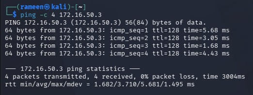

**Engines that responded:**

-**Suricata** — triggered the `GPL ICMP PING *NIX` signature alert
- **Zeek** — recorded connection metadata in `zeek.conn`

#### Suricata Alert

**Hunt query:**

event.dataset: suricata.alert


**Screenshot:**

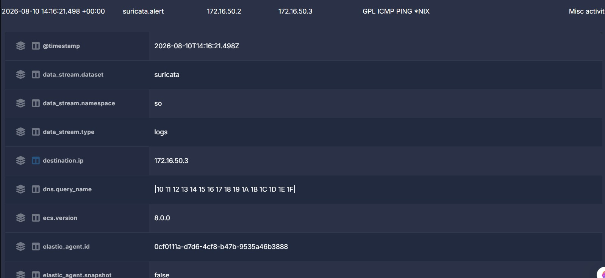

---

#### Suricata EVE JSON

**EVE log file:**

/nsm/suricata/eve-2026-08-10-14:16.json


**Associated PCAP:**

/nsm/suripcap/1/so-pcap.1786369425


**Screenshot:**


---

#### Suricata Log File Path

**Screenshot:**

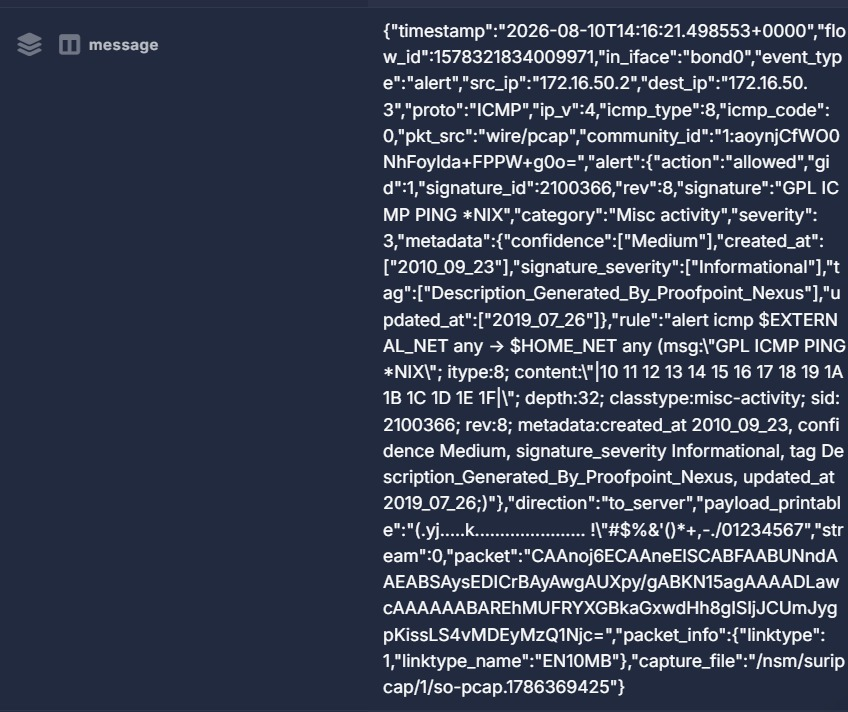

---

### 2.2.2  Scenario 2 — TCP Connection Auditing (Zeek)

**Command run on Kali:**

```bash
nc -zv 172.16.50.3 80
```

**Engines that responded:**

- **Zeek** — logged full TCP connection metadata in `zeek.conn`
- **Suricata** — inspected traffic against its configured rules

#### Zeek Connection Log

**Hunt query:**

event.dataset: zeek.conn AND source.ip: 172.16.50.2 AND destination.ip: 172.16.50.3 AND destination.port: 80

**Screenshot:**

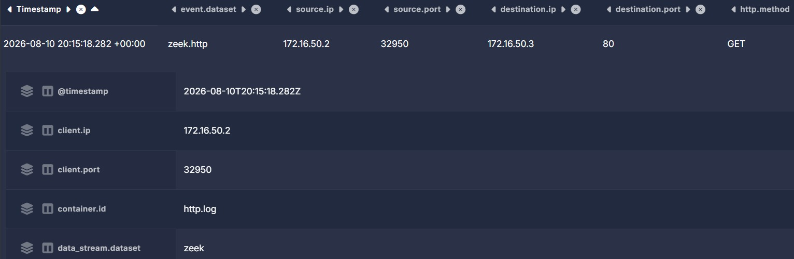

---

### 2.2.3 Scenario 3 — LLMNR / Name Resolution Test

Windows ping rameen generated an LLMNR name-resolution request. Zeek recorded this traffic in zeek.dns with UDP destination port 5355.

#### DNS Resolution Test

**Command run on Windows:**

```bash
ping rameen
```
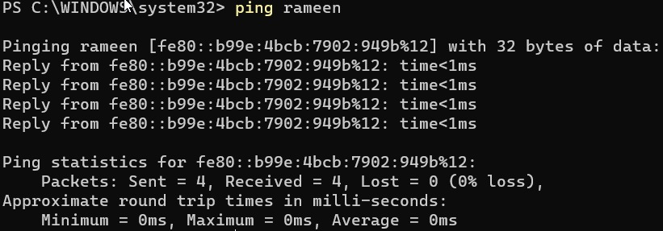

**Hunt query:**

event.dataset: zeek.dns


**Extracted fields:**

| Field                  | Value                     |
|------------------------|---------------------------|
| `@timestamp`           | `2026-08-11 12:34:02.660` |
| `event.dataset`        | `zeek.dns`                |
| `client.port`          | `56845`                   |
| `destination.ip`       | `172.16.50.3`             |
| `destination.port`     | `5355`                    |
| `protocol`             | UDP                       |
| `container.id`         | `dns.log`                 |
| `data_stream.dataset`  | `zeek`                    |
| `data_stream.namespace`| `so`                      |
| `data_stream.type`     | `logs`                    |

---

#### HTTP Request Test

**Command run on Kali:**

```bash
curl  http://172.16.50.3/
```
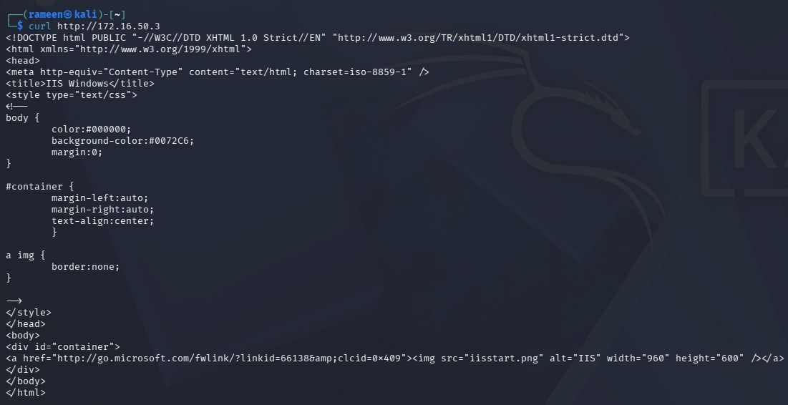


**Hunt query:**

event.dataset: zeek.http


**Screenshot:**


---

## 2.2.4 Hunt Query Reference

| Purpose                             | Query                                                           |
|-------------------------------------|-----------------------------------------------------------------|
| All Suricata alerts                 | `event.dataset: suricata.alert`                                 |
| Suricata alerts on Windows VM       | `event.dataset: suricata.alert AND destination.ip: 172.16.50.3` |
| Zeek connections from Kali          | `event.dataset: zeek.conn AND source.ip: 172.16.50.2`           |
| All HTTP traffic                    | `event.dataset: zeek.http`                                      |
| All DNS traffic                     | `event.dataset: zeek.dns`                                       |
| All Kali traffic (either direction) | `source.ip: 172.16.50.2 OR destination.ip: 172.16.50.2`         |

---

## 2.2.5 Key Takeaways

**Suricata = Detector.** Fires alerts when traffic matches a signature — gives you rule name, ID, severity, and category.

**Zeek = Investigator.** Records every connection, DNS query, and HTTP transaction silently — gives you context around any alert.

**Typical SOC workflow:**

1. Suricata alert fires → note `source.ip` / `destination.ip`
2. Search `zeek.conn` to see all connections from that host
3. Search `zeek.dns` and `zeek.http` to reconstruct activity
4. Pull PCAP from `/nsm/suripcap/` for deep inspection

---

## 2.3 Endpoint Security Monitoring (ESM)

> **Evaluation Mode Note:** Full Wazuh agent deployment and host-based alerting exploration were restricted due to eval-mode limitations. However, Elastic Fleet agent management and Osquery live querying were fully accessible and explored.

---

### 2.3.1 Background: Elastic Fleet vs. Wazuh

Both Elastic Fleet and Wazuh serve as **Endpoint Security Monitoring (ESM)** platforms, but they differ in architecture, scope, and integration depth.

#### Elastic Fleet

Elastic Fleet is the **centralized management layer for Elastic Agents** within the Elastic Stack (Kibana/Elasticsearch). It provides:

- **Unified agent management** — deploy, configure, update, and monitor Elastic Agents across all hosts from a single UI
- **Policy-based integration control** — each agent is assigned an *Agent Policy* that bundles integrations (e.g., log shippers, Osquery, system metrics)
- **Data stream routing** — collected data is streamed to Elasticsearch via configured outputs (e.g., `so-manager_elasticsearch`)
- **Health visibility** — real-time agent status (Healthy / Unhealthy / Orphaned), last check-in time, version, and privilege mode

In Security Onion, Elastic Fleet manages agents on the SO node itself and any enrolled grid nodes, enabling log ingestion pipelines like `import-zeek-logs`, `import-suricata-logs`, `import-evtx-logs`, and more.

#### Wazuh

Wazuh is an **open-source host-based security platform** that provides endpoint monitoring, threat detection, and response capabilities. It can monitor:

- **File integrity** — detects unauthorized changes to files
- **Log events** — collects and analyzes operating-system and application logs
- **Running processes** — provides visibility into processes on monitored hosts
- **Security configuration** — checks endpoint configuration and security-related settings
- **Threat detection** — generates alerts from endpoint activity and security rules
- **MITRE ATT&CK mapping** — helps classify detected activity according to ATT&CK techniques
- **Active response** — can perform automated response actions when configured

Wazuh uses an **agent-based architecture**, where agents installed on endpoints collect host information and communicate with a central Wazuh server.

> **Important Security Onion 3.x distinction:** Wazuh is not the endpoint monitoring platform used in this Security Onion 3.2.0 evaluation. Security Onion 3.x uses **Elastic Agent and Elastic Fleet** for endpoint data collection and agent management.

### 2.3.2 Wazuh in This Evaluation

Wazuh was **not deployed or tested as an endpoint monitoring component** during this Security Onion 3.2.0 evaluation.

Instead, endpoint-related functionality was explored through the Security Onion components available in the lab, particularly **Elastic Fleet, Elastic Agent, and Osquery**.

Therefore, no Wazuh agent enrollment, Wazuh Manager configuration, Wazuh-specific rules, or Wazuh-generated alerts were included in the hands-on portion of this project.

Wazuh is documented here for **feature comparison and background research**, rather than as a component that was successfully deployed in the evaluation environment.

| Platform | Main Purpose |
|---|---|
| **Elastic Fleet** | Centralized management of Elastic Agents and their data collection |
| **Elastic Agent** | Collects endpoint telemetry and sends it to Security Onion |
| **Osquery** | Provides detailed host-state information through SQL-like queries |
| **Wazuh** | Separate open-source endpoint security and threat-detection platform |

> **Lab finding:** Because Wazuh was not deployed in this Security Onion 3.2.0 evaluation, no Wazuh alerts or Wazuh endpoint events were used in the investigation workflow. The hands-on endpoint exploration focused on the Elastic Agent/Fleet and Osquery functionality available in the lab.
---

### 2.3.3 Elastic Fleet: What Was Explored

####  Fleet Agent Overview

Navigating to **Fleet → Agents** revealed two registered agents on the Security Onion node:

| Host                              | Agent Policy                             | Version | Status  | Privilege Mode |
|-----------------------------------|------------------------------------------|---------|---------|----------------|
| `FleetServer-securityonionrameen` | `FleetServer_securityonionrameen` rev. 8 | 9.3.7   | Healthy | Non-root       |
| `securityonionrameen`             | `so-grid-nodes_general` rev. 34          | 9.3.7   | Healthy | Root           |

**Screenshot:**

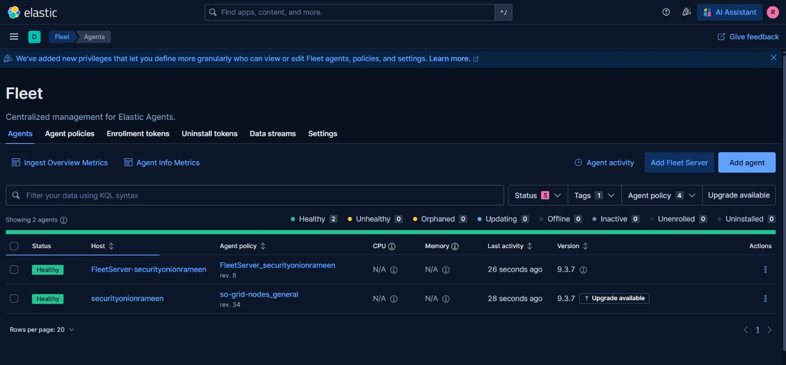

---

#### 2.3.4 Fleet Server Agent Details

The **FleetServer-securityonionrameen** agent acts as the Fleet Server itself — it manages communication between Kibana and all enrolled Elastic Agents.


**Screenshot:**

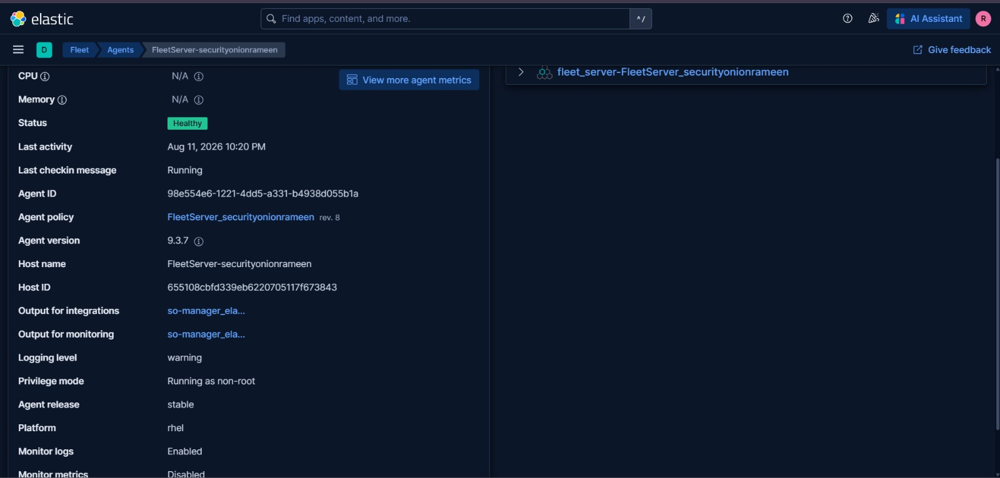

---

#### 2.3 Security Onion Node Agent Details

The **securityonionrameen** agent is assigned the `so-grid-nodes_general` policy and handles the bulk of log ingestion — Zeek, Suricata, EVTX, Osquery, and more.

**Active integrations visible on this agent are shown in the screenshot below:**


**Screenshot:**

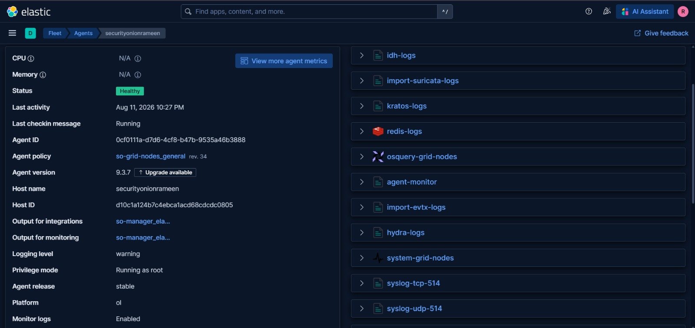

---

#### 2.3.1 Agent Policy: so-grid-nodes_general


**Screenshots:**

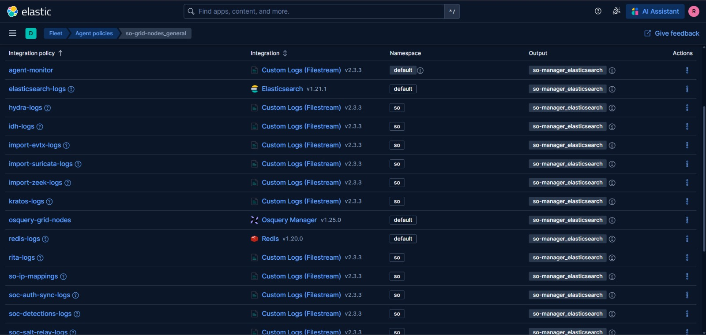

---

### 2.4 Osquery: Live Host Inspection

**Osquery** is a host instrumentation framework that exposes OS state as queryable SQL tables. In Security Onion, it is managed via the `osquery-grid-nodes` integration within Elastic Fleet and is accessible through **Kibana → Osquery → Live Queries**.

Queries were run against the `securityonionrameen` agent (`0cf0111a-d7d6-4cf8-b47b-9535a46b3888`).

---

#### 2.4.1 Query 1 — Listening Ports & Associated Processes

**Purpose:** Identify all active network listeners on the SO node and map each to its owning process.

**Query:**

```sql
SELECT DISTINCT lp.port, lp.address, lp.protocol, p.name, p.pid
FROM listening_ports lp
JOIN processes p ON lp.pid = p.pid
WHERE lp.port > 0
ORDER BY lp.port;
```

**Screenshot:**

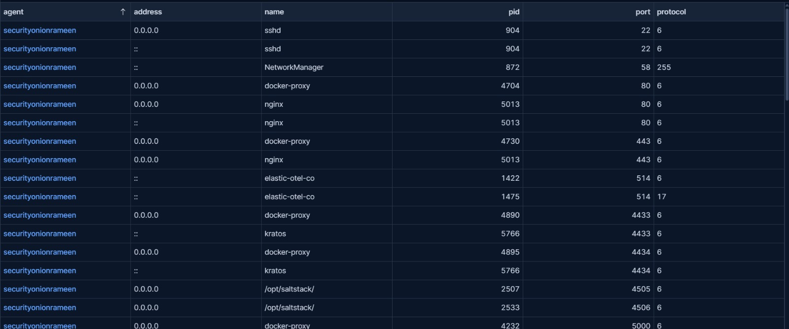


**Analyst Notes:**
- `sshd` on port 22 confirms remote management access is active
- `nginx` on ports 80 and 443 serves the Security Onion web interface (proxied via `docker-proxy`)
- `elastic-otel-co` on port 514 handles syslog ingestion (TCP + UDP)
- `kratos` on ports 4433/4434 is the identity/auth service used by the SO SOC portal
- `/opt/saltstack/` on ports 4505/4506 is SaltStack, used by Security Onion for node configuration management

---

#### 2.4.2 Query 2 — Recently Started Processes

**Purpose:** Identify the 20 most recently launched processes on the host to detect unusual or unexpected execution.

**Query:**

```sql
SELECT pid, name, path, cmdline, start_time
FROM processes
ORDER BY start_time DESC
LIMIT 20;
```

**Screenshot:**

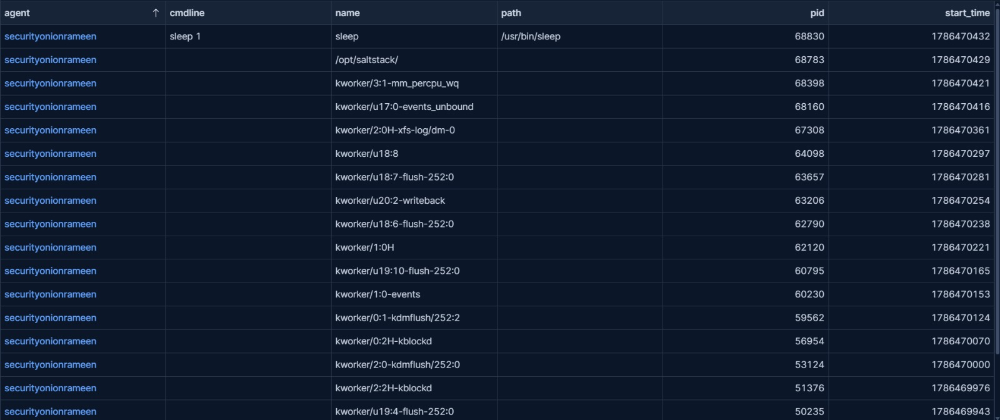

---

#### 2.4.3 Query 3 — Logged-In Users

**Purpose:** Identify currently active sessions on the SO node.

**Query:**

```sql
SELECT user, host, time, tty
FROM logged_in_users;
```

**Screenshot:**

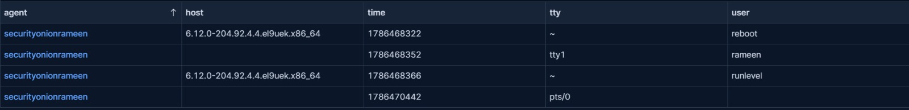

---

#### 2.4.5 Osquery in Eval Mode — Scope & Limitations

| Capability                                       | Available in Eval Mode             |
|--------------------------------------------------|------------------------------------|
| Run live queries against SO node                 |  Yes                               |
| View query history                               |  Yes                               |
| Query external enrolled hosts (Windows VM, Kali) |  No — agents not enrolled          |
| Deploy Osquery packs to remote hosts             |  No — requires agent enrollment    |
| Schedule recurring queries                       |  No — requires policy write access |

> In eval mode, Osquery was fully functional for **local host inspection of `securityonionrameen`** but could not be extended to the Windows VM or Kali machine due to the absence of enrolled Elastic Agents on those hosts.

---

### 2.6 ESM Key Takeaways

**Elastic Fleet = Agent Lifecycle Manager.** Controls what each host collects, how it's configured, and where data is routed. The `so-grid-nodes_general` policy with 23 integrations is the backbone of Security Onion's log ingestion pipeline.

**Wazuh = Host-Based Threat Detector.** Applies rule-based detection to endpoint events (file changes, process execution, log entries) and maps findings to MITRE ATT&CK. Requires agent enrollment to generate alerts — not explorable in eval mode without write-level access.

**Osquery = Host State Inspector.** Turns the OS into a queryable database. Ideal for ad-hoc investigation: "What is listening on this host right now? Who is logged in? What processes just started?" Results are immediately visible in Kibana via the Fleet Osquery interface.

**Typical ESM workflow:**

1. Suricata/Zeek alert fires on a source IP
2. Use Osquery to inspect that host's listening ports and running processes in real time
3. Cross-reference with Wazuh host-based alerts to confirm or rule out lateral movement
4. Use Fleet to verify agent health and confirm log collection is active on the host

---
**What this rule does:** Fires on any ICMP echo request (`itype:8`) from an external host to the home network where the first 32 bytes of payload match a specific hex sequence characteristic of Linux/Unix `ping` implementations.

---
## 3. Detections & Alerting

### 3. Examining an Existing Sigma Rule — Possible Impacket SecretDump Remote Activity

A high-severity Sigma rule from the `core` ruleset was also reviewed to contrast with the Suricata format.

**Rule metadata:**

| Field      | Value                                                       |
|------------|-------------------------------------------------------------|
| Title      | `Possible Impacket SecretDump Remote Activity - Zeek`       |
| Rule ID    | `92dae1ed-1c9d-4eff-a567-33acbd95b00e`                      |
| Author     | Samir Bousseaden, @neu5ron                                  |
| Engine     | Sigma                                                       |
| Ruleset    | core                                                        |
| Severity   | high                                                        |
| Status     | test                                                        |
| Created    | 2020-03-19                                                  |
| Modified   | 2021-11-27                                                  |
| MITRE Tags | `attack.credential-access`, T1003.002, T1003.003, T1003.004 |

**Detection logic (Sigma YAML):**

```yaml
title: Possible Impacket SecretDump Remote Activity - Zeek
id: 92dae1ed-1c9d-4eff-a567-33acbd95b00e
status: test
description: >
  Detect AD credential dumping using impacket secretdump HKTL.
  Based on the SIGMA rules/windows/builtin/win_impacket_secretdump.yml
references:
  - https://web.archive.org/web/20230329153811/https://blog.menasec.net/2019/02/threat-huting-10-impacketsecretdump.html
author: 'Samir Bousseaden, @neu5ron'
date: 2020-03-19
modified: 2021-11-27
tags:
  - attack.credential-access
  - attack.t1003.002
  - attack.t1003.004
  - attack.t1003.003
logsource:
  product: zeek
  service: smb_files
detection:
  selection:
    path|contains|all:
      - '\'
      - 'ADMIN$'
    name|contains: 'SYSTEM32\'
    name|endswith: '.tmp'
  condition: selection
falsepositives:
  - Unknown
level: high
```

**What this rule does:** Targets Zeek `smb_files` logs. Fires when an SMB file path contains both `\` and `ADMIN$`, the filename contains `SYSTEM32\`, and the filename ends with `.tmp` — a pattern consistent with Impacket's `secretsdump` tool dropping temporary files during NTDS/SAM extraction.

> **Key contrast with Suricata:** Sigma rules operate on *already-parsed log fields* in Elasticsearch (here, Zeek SMB metadata). Suricata rules operate on *raw packet payloads* in real time. Sigma = post-hoc log analysis; Suricata = inline traffic inspection.


---

### 3.2 Overrides — Concept & Application

**What is an Override?**

An Override is a per-rule tuning instruction that modifies how Security Onion handles alerts generated by a specific detection rule — without disabling the rule entirely. Overrides let analysts reduce noise from known-benign sources while keeping the detection active for genuinely suspicious traffic.

Security Onion supports three override types:

| Override Type    | What it does                                                                                                                                 |
|------------------|----------------------------------------------------------------------------------------------------------------------------------------------|
| **Suppress**     | Silences alerts matching specific criteria (e.g., by source IP, destination IP). The rule still runs — matching traffic just doesn't generate a                    visible alert                                                                                                                                 |
| **Threshold**    | Only fires an alert after a rule matches N times within a time window — reduces noise from high-frequency low-severity events                 |
| **Event Filter** | Similar to threshold; limits alert generation rate per tracked field                                                                          |

Overrides are tracked per-rule and visible in the **Tuning** tab of each detection. The override count shown on the Detections list view indicates how many tuning entries exist for that rule.

---

#### 3.2.1 Custom Override Created — GPL ICMP PING \*NIX (Suppress)

To suppress the high volume of benign ICMP ping alerts generated by the Kali lab host during testing, a **Suppress** override was created on the `GPL ICMP PING *NIX` rule.


**What this does:** Any ICMP ping alert where the source IP is exactly `172.16.50.2` (Kali) will be suppressed — it will not appear in the Alerts queue. Pings from any other source are still alerted normally.

**Screenshot:**

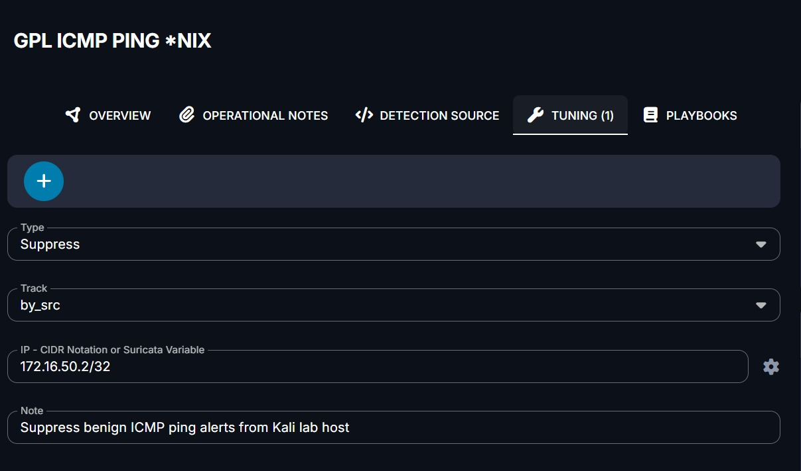

---

### 3.4 Custom Detection Rules

Two custom Suricata rules were authored and deployed to validate the detection pipeline end-to-end: trigger a known benign action on Kali, confirm the alert fires in the SO Alerts queue.

---

#### 3.4.1 Custom Rule 1 — ICMP Ping with Specific Payload

**Objective:** Detect ICMP echo requests containing a custom string payload (`LABPING`) sent specifically from Kali to the Windows VM — demonstrating that custom payload-matching rules work beyond the generic `GPL ICMP PING *NIX`.

**Detection logic:**
icmp 172.16.50.2 any -> 172.16.50.3 any
itype:8
content:"LABPING"


**Test command run on Kali:**

```bash
ping -c 5 -p 4c414250494e47 172.16.50.3
```

> `-p 4c414250494e47` sets the ICMP payload pattern to the hex encoding of `LABPING`

**Screenshot — Kali command:**

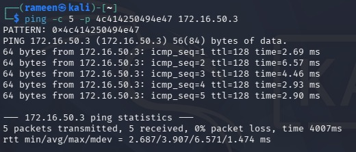


**Screenshot — Custom Rule Overview:**

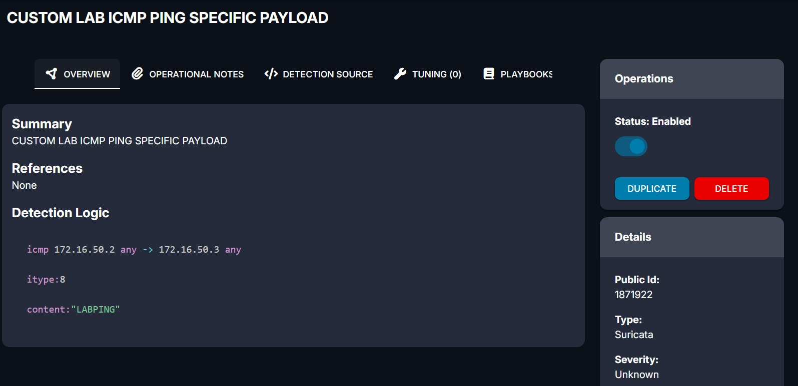

---

#### 3.4.2 Custom Rule 2 — HTTP Custom User-Agent Detection

**Objective:** Detect HTTP requests carrying a custom `User-Agent` header string (`SOC-TEST-AGENT`) — simulating detection of a non-standard tool or implant beaconing over HTTP.

**Test command run on Kali:**

```bash
curl -A 'SOC-TEST-AGENT' http://172.16.50.3/
```

**Output confirmed IIS Windows default page was returned:**

```html
<title>IIS Windows</title>
```

**Screenshot — Kali curl command:**

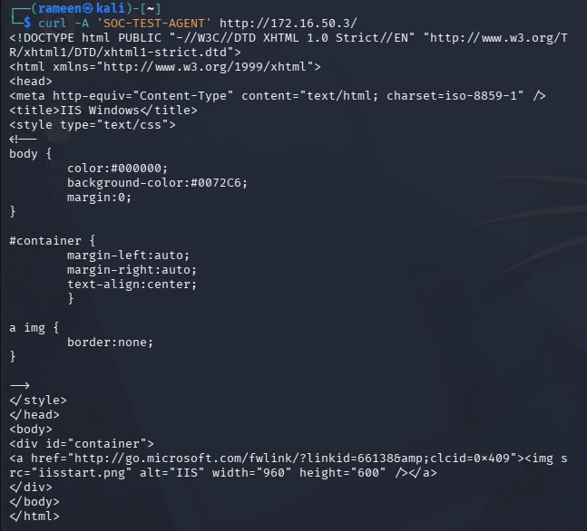


---

### 3..5 Alerts Queue — End-to-End Confirmation

After running all test traffic, the **Alerts** dashboard (last 24 hours, grouped by Name and Module) showed the following:


> **Notable:** The `Security Onion - SOC Login Failure` Sigma alert (high severity) fired independently — demonstrating that Sigma rules operating on authentication logs work in parallel with Suricata network rules.

**Screenshot:**

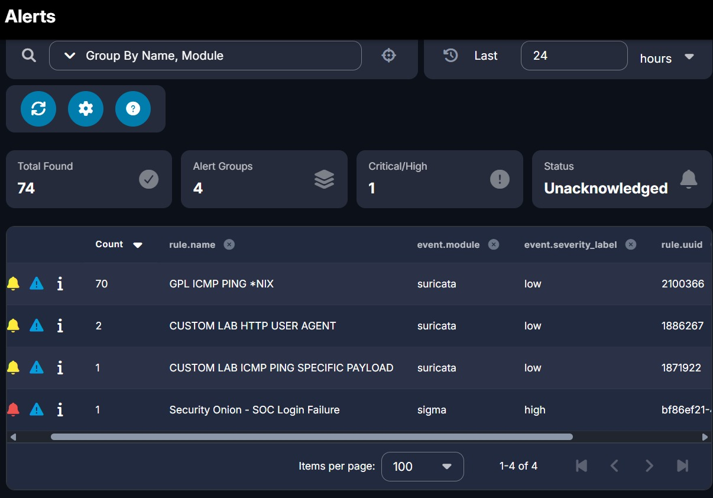

---

### 3.6 Detections Key Takeaways

**Suricata rules = real-time packet inspection.** Written in Suricata syntax, they match against raw traffic fields (IP, protocol, payload bytes, HTTP headers). Fast, stateless, and high-volume.

**Sigma rules = log-field behavioral detection.** Written in YAML, they match against already-parsed Elasticsearch fields from any log source (Zeek, Windows Events, Sysmon). More flexible, works across log types.

**Overrides = precision noise control.** Instead of disabling a rule entirely, Suppress/Threshold overrides let you silence known-good sources while keeping detection active everywhere else. Critical for production SOC tuning.

**Custom rules close coverage gaps.** The built-in ETOPEN and core rulesets cover broad threat categories, but lab-specific or org-specific detections (custom User-Agents, internal tool signatures, specific subnet behavior) require custom rules authored directly in the Detections UI.

**Typical Detection workflow:**

1. Review Detections inventory — understand which rulesets are enabled and their coverage
2. Inspect individual rules to understand detection logic and MITRE mapping
3. Create Overrides on noisy low-fidelity rules to reduce alert fatigue
4. Author custom rules for environment-specific visibility gaps
5. Validate custom rules by generating controlled test traffic and confirming alerts fire

---
---

## 4. Threat Hunting & Analysis

### 4.1 SOC Dashboard — Tier 1 Analyst View

The **Dashboards** interface provides a real-time grouped metrics view across all ingested alert data. For Tier 1 analyst work, the most relevant widgets are top talkers by source/destination IP, top alert rule names, destination ports, and rule categories — giving an immediate picture of what is noisy and what needs triage.

**Widgets configured for Tier 1 view:**

| Widget           | Value Observed                                                                                      |
|------------------|-----------------------------------------------------------------------------------------------------|
| rule.category    | Misc activity (70), [other] (5)                                                                     |
| source.ip        | 172.16.50.2 (75 events)                                                                             |
| destination.ip   | 172.16.50.3 (75 events)                                                                             |
| destination.port | 80 (3 events)                                                                                       |
| rule.name        | GPL ICMP PING \*NIX (70), CUSTOM LAB HTTP USER AGENT (3), CUSTOM LAB ICMP PING SPECIFIC PAYLOAD (2) |

The source/destination IP map (top-right heat tile) immediately visualized that all traffic flowed from `172.16.50.2` → `172.16.50.3`, confirming a single attacker-to-target flow pattern consistent with the lab setup.

**Screenshot:**

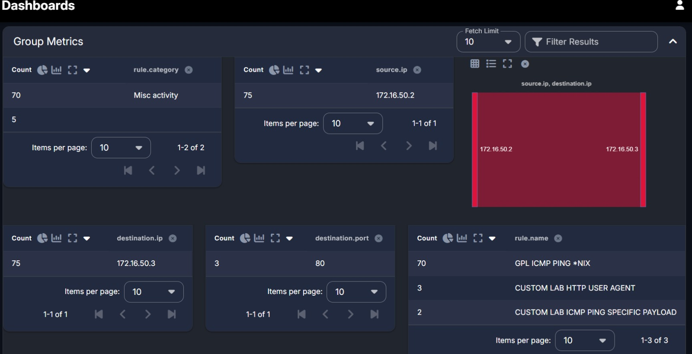

---

### 4.2 Hunt Interface — Searching for Custom Alert

The **Hunt** interface was used to search for the `CUSTOM LAB HTTP USER AGENT` alert specifically, isolating the events generated by the `curl -A 'SOC-TEST-AGENT'` test command.

**Hunt query used:**

rule.name:"CUSTOM LAB HTTP USER AGENT"


> **Note:** Hunt excludes Case Data, Detections Data, SOC Logs, and Onion AI Data from results by default — keeping the event view clean and focused on raw network/log telemetry.

**Screenshot:**

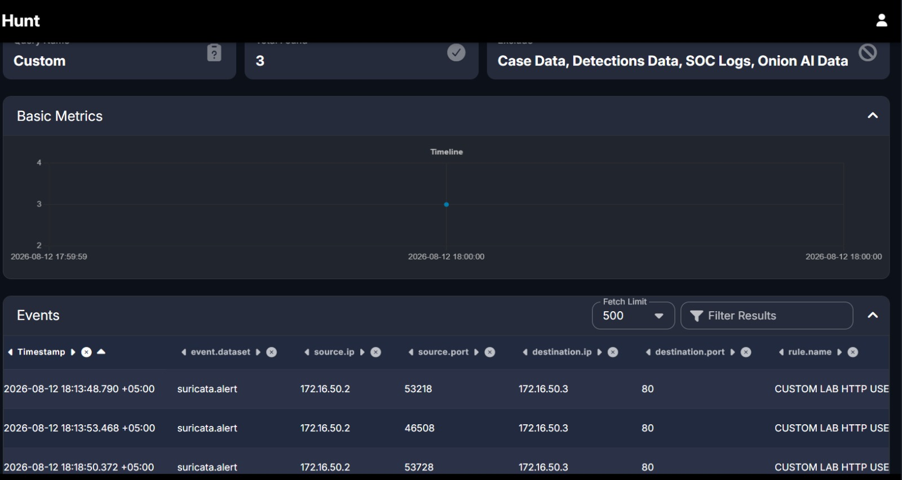

---

### 4.3 Pivoting — Alert to Network Context

The `CUSTOM LAB HTTP USER AGENT` Suricata alert was used as the pivot point for a full triage chain.

**Alert anchor fields:**

| Field | Value |
|-------|-------|
| Rule Name | CUSTOM LAB HTTP USER AGENT |
| SID | 1886267 |
| Source IP | 172.16.50.2 |
| Source Port | 53218 / 46508 / 53728 |
| Destination IP | 172.16.50.3 |
| Destination Port | 80 |
| Protocol | TCP |
| User-Agent | SOC-TEST-AGENT |
| Action | allowed |

**HTTP payload extracted from alert:**

GET / HTTP/1.1
Host: 172.16.50.3
User-Agent: SOC-TEST-AGENT
Accept: /


**Server response:**

HTTP/1.1 200 OK
Content-Type: text/html
Server: Microsoft-IIS/10.0
Content-Length: 696


**Related alerts found during pivot** (querying ±3 days on both IPs):

| Count | Rule Name | Module | Category |
|-------|-----------|--------|----------|
| 91 | GPL ICMP PING \*NIX | suricata | Misc activity |
| 10 | ET HUNTING curl User-Agent to Dotted Quad | suricata | Potentially Bad Traffic |
| 2 | CUSTOM LAB HTTP USER AGENT | suricata | — |
| 2 | ET SCAN Suspicious inbound to MSSQL port 1433 | suricata | Potentially Bad Traffic |
| 2 | ET SCAN Suspicious inbound to PostgreSQL port 5432 | suricata | Potentially Bad Traffic |

> **Analyst note:** The `ET HUNTING curl User-Agent to Dotted Quad` rule fired because `curl` was issued directly against an IP address (`172.16.50.3`) rather than a hostname — a pattern Suricata flags as potentially suspicious. This is expected lab behavior, not a true positive.


### 4.4 PCAP Analysis

A PCAP job was created for the HTTP test traffic between `172.16.50.2` and `172.16.50.3` on TCP port 80. The SO built-in PCAP viewer rendered the full session.


**What the PCAP confirmed:**
- Packets 0–2: Clean TCP three-way handshake (SYN / SYN-ACK / ACK)
- Packet 3: HTTP GET request containing `SOC-TEST-AGENT` User-Agent (PSH ACK, 144 bytes)
- Packets 4–5: Server acknowledgement and HTTP 200 OK response from Microsoft-IIS/10.0 (987 bytes)
- Packets 7–9: Clean connection teardown (FIN ACK exchange)

The PCAP fully corroborated the Suricata alert — the detection fired on the exact packet carrying the custom User-Agent string.

**Screenshot:**

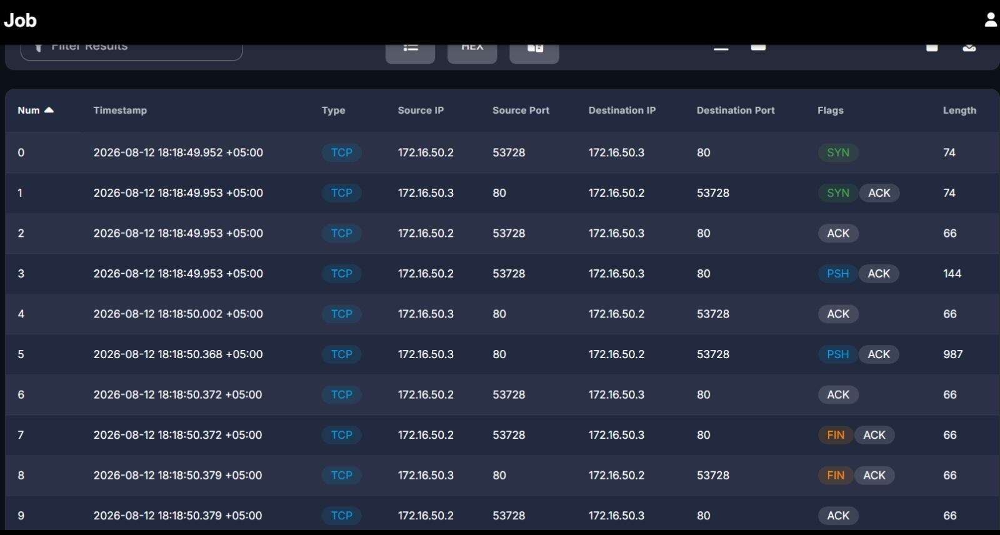

---

### 4.5 CyberChef — Base64 Decode

The integrated **CyberChef** tool (accessible via the SO sidebar under Tools) was used to decode a Base64-encoded string extracted from the HTTP session context.

This confirmed that the User-Agent string observed in the Suricata alert and PCAP matched the value embedded in the curl command — closing the loop between test traffic generation and detection.

**Screenshot:**

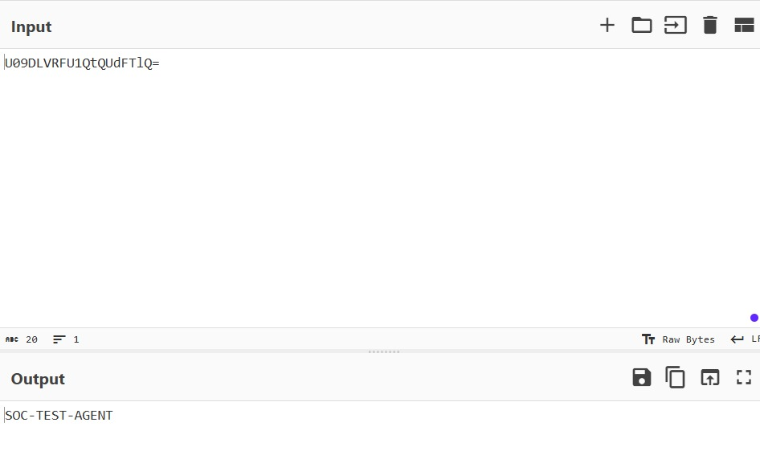

---

## 5. Incident Response & Automation

### 5.1 Playbooks — Guided Analysis Walkthrough

Security Onion's **Playbooks** feature (introduced in SO 2.4.160) provides structured, step-by-step triage guidance attached to individual detection rules. Each playbook step runs an automated Hunt query scoped to the alert being investigated and surfaces results inline — reducing analyst cognitive load during triage.

> **Eval mode note:** Creating new playbooks requires write access not available in eval mode. An existing playbook attached to the `CUSTOM LAB HTTP USER AGENT` rule was walked through against the live alert.

---

#### Playbook Steps Executed

**Step 1 — What specifically does the alert describe?**

Reviewed the detection description and Suricata rule signature to understand what behavior the rule targets.

Hunt query run automatically:

tags:alert AND _id:NODATA | table @timestamp rule.name rule.category network.data.decoded


Result:

| @timestamp | rule.name | network.data.decoded |
|-----------|-----------|---------------------|
| 2026-08-12T13:13:53.468Z | CUSTOM LAB HTTP USER AGENT | GET / HTTP/1.1 Host: 172.16.50.3 User-Agent: SOC-TEST-AGENT Accept: \*/\* |

---

**Step 2 — What internal system is involved?**

Identified the internal host involved in the alert to assess potential risk surface.

Hunt query:

tags:alert AND _id:NODATA | table @timestamp source.ip source.port destination.ip destination.port


Result:

| @timestamp | source.ip | source.port | destination.ip | destination.port |
|-----------|-----------|------------|---------------|-----------------|
| 2026-08-12T13:13:53.468Z | 172.16.50.2 | 46508 | 172.16.50.3 | 80 |

---

**Step 3 — Are there other alerts associated with these hosts?**

Broadened the scope to ±3 days to check for related detections on either IP.

Hunt query:

tags:alert AND ((source.ip:(172.16.50.2 OR 172.16.50.3)) OR
(destination.ip:(172.16.50.2 OR 172.16.50.3))) |
groupby event.module* rule.name* rule.category*


Results confirmed the related alert context documented in Section 4.3.

---

**Step 4 — Are there any file transfers associated with this alert?**

Checked for file content transferred in the HTTP session using the community ID.

Hunt query:

(event.category:network AND tags:file) AND
(network.community_id:1:z46Yq+a5v118D3ThN+JfcMvLi/4=) |
table @timestamp file.source file.mime_type file.bytes.total


Result:

| @timestamp | file.source | file.mime_type | file.bytes.total |
|-----------|------------|----------------|-----------------|
| 2026-08-12T13:13:53.467Z | HTTP | text/html | 696 |

Confirmed: server returned 696 bytes of `text/html` — the IIS default page. No malicious file transfer.

---

**Step 5 — Are there DNS queries or TLS certificates associated with the connection?**

- **DNS:** No DNS queries found — `curl` was issued directly against an IP, no hostname resolution occurred. Expected.
- **TLS:** No TLS data found — traffic was plaintext HTTP on port 80.

---

**Playbook verdict:** All steps resolved cleanly. Traffic confirmed as lab-generated, benign, and fully correlated with the underlying PCAP.

---

### 5.2 Case Management — Investigation Lifecycle

A **Case** was created in Security Onion to document the full investigation lifecycle of the `CUSTOM LAB HTTP USER AGENT` alert from open to closed.

**Case description:**

> Investigation of custom HTTP test traffic between 172.16.50.2 and 172.16.50.3 over TCP port 80. The activity was generated as part of a controlled Security Onion lab to test HTTP detection and case investigation capabilities.

---


#### Observables Logged


**Screenshot:**

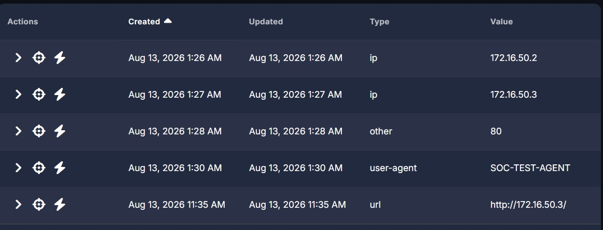

---

#### Events Linked


**Screenshot:**

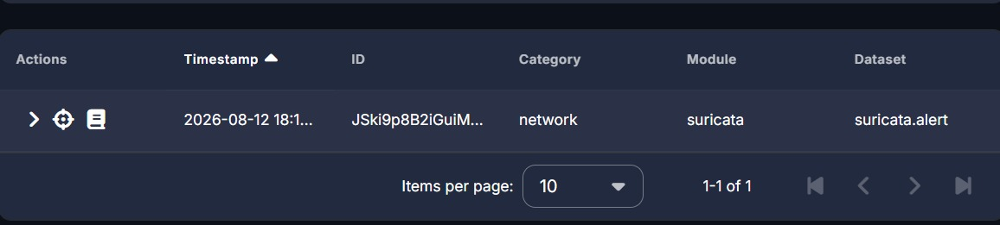

---

#### Investigation Comment

> PCAP analysis confirmed the complete TCP session from 172.16.50.2:53728 to 172.16.50.3:80, including the three-way handshake, HTTP GET request containing the SOC-TEST-AGENT User-Agent, HTTP/1.1 200 OK response identifying Microsoft-IIS/10.0, and connection termination. The traffic generated the CUSTOM LAB HTTP USER AGENT Suricata alert (SID 1886267), confirming that the detection correlated with the underlying packet-level traffic.
>
> — rameen@securityonion.com • Aug 13, 2026 1:21 AM

---

#### Case Closure Summary

> **Investigation completed successfully.**
>
> The CUSTOM LAB HTTP USER AGENT alert (SID 1886267) was generated by intentionally simulated HTTP traffic during a controlled Security Onion lab exercise. Analysis confirmed communication from 172.16.50.2:53728 to 172.16.50.3:80.
>
> Evidence collected:
> - Suricata detection alert
> - Full PCAP capture
> - Source and destination IP observables
> - TCP port 80 observable
> - SOC-TEST-AGENT User-Agent observable
>
> PCAP analysis verified the complete TCP three-way handshake, HTTP GET request containing the custom SOC-TEST-AGENT User-Agent, an HTTP/1.1 200 OK response from Microsoft-IIS/10.0, and normal connection termination.
>
> **Final Verdict:** Authorized lab-generated HTTP traffic. No malicious activity identified. Alert successfully correlated with packet-level evidence. Investigation complete — case closed.

**Screenshot:**

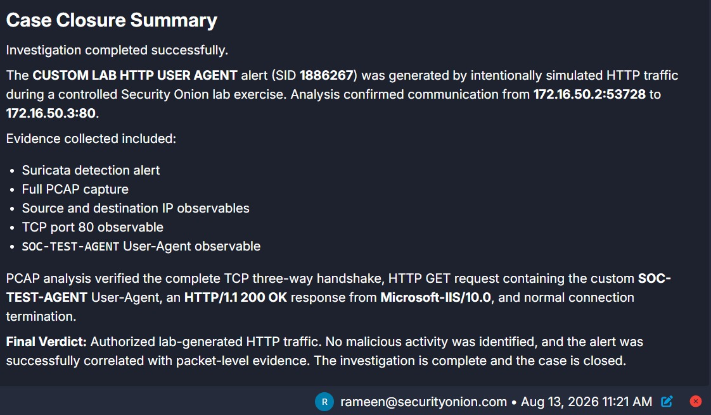

---

### 5.3 API Exploration

#### 5.3.1 Internal Elasticsearch Query (Eval Mode)

The **Security Onion Connect API** (the official external REST API) requires a **Security Onion Pro license** and is not available in eval mode. However, the internal Elasticsearch instance is accessible directly on the SO node via `so-elasticsearch-query`, which was used to programmatically fetch recent alerts.

A Python script (`fetch_alerts.py`) was written and executed on the `securityonionrameen` node:

```python
import json
import subprocess

def query_so_alerts():
    command = [
        "sudo", "so-elasticsearch-query",
        ".ds-logs-detections.alerts-so-2026.08.10-000001/_search?pretty",
        "-d", json.dumps({
            "size": 5,
            "_source": ["@timestamp", "rule.name"],
            "sort": [{"@timestamp": {"order": "desc"}}]
        })
    ]

    try:
        result = subprocess.run(
            command,
            capture_output=True,
            text=True,
            check=True
        )

        data = json.loads(result.stdout)
        print(f"[+] Total Alerts Found: {data['hits']['total']['value']}\n")
        print(f"{'TIMESTAMP':<28} | {'RULE NAME'}")
        print("-" * 75)

        for hit in data['hits']['hits']:
            source = hit['_source']
            ts = source.get('@timestamp', 'N/A')
            rule = source.get('rule', {}).get('name', 'N/A')
            print(f"{ts:<28} | {rule}")

    except Exception as e:
        print(f"[-] Error querying alerts: {e}")

if __name__ == "__main__":
    query_so_alerts()
```

**Execution:**

```bash
python3 fetch_alerts.py
```

**Screenshots:**

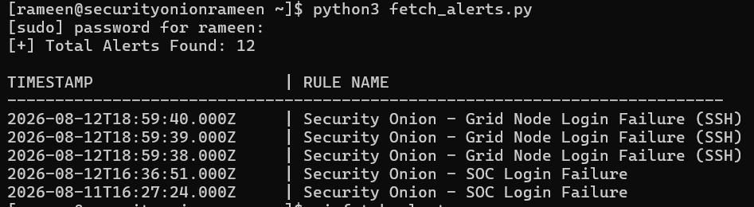

---

#### 5.3.2 Official Connect API — Pro Feature Reference

The **Security Onion Connect API** is the official external REST API, available exclusively to **Security Onion Pro** licensed deployments (introduced in SO 2.4.120). It is not accessible in eval or community standalone mode.

**Authentication flow (OAuth 2.0 client credentials):**

Step 1 — Create an API client under Administration → API Clients in a Pro deployment, generating a `CLIENT_ID` and `CLIENT_SECRET`.

Step 2 — Obtain a bearer token:

```bash
curl --cacert ca.crt -X POST \
  -u "CLIENT_ID:CLIENT_SECRET" \
  https://BASE_URL/oauth2/token \
  -d grant_type=client_credentials
```

Step 3 — Use the token to call API endpoints:

```bash
curl --cacert ca.crt -X GET \
  -H "Authorization: Bearer ACCESS_TOKEN" \
  https://BASE_URL/connect/info
```

**Key Connect API capabilities:**

| Endpoint                          | Purpose                              |
|-----------------------------------|--------------------------------------|
| `POST /oauth2/token`              | Authenticate and obtain bearer token |
| `GET /connect/info`               | Retrieve grid info and version       |
| `GET /connect/events`             | Query events/alerts                  |
| `GET /connect/cases`              | List and manage cases                |
| `POST /connect/cases`             | Create a new case programmatically   |
| `GET /connect/detections`         | Query detection rules                |
| `GET /connect/assistant/sessions` | Interact with Onion AI (Pro)         |

> **Reference:** [Security Onion Connect API Docs](https://docs.securityonion.net/en/2.4/connect.html) — For full API specification see the [SO API Reference](https://docs.securityonion.net/en/3/main/connect-api/so-api-reference.html)

---

### 5.4 Enterprise Features Research

The following features are part of **Security Onion Pro** — the licensed enterprise tier. None are available in eval or community standalone mode.

---

#### 5.4.1 Onion AI Assistant

**Introduced:** SO 2.4.190 (October 2025), major improvements in SO 2.4.200

Onion AI is an AI-powered assistant embedded directly in the SOC UI. It is disabled by default and must be enabled by a superuser under Administration → Configuration → `soc > config > server > client > assistant > enabled`.

**Capabilities:**

| Feature                      | Description                                                          |
|------------------------------|----------------------------------------------------------------------|
| Alert triage assistance      | Explains what a fired detection means in plain language              |
| Detection tuning suggestions | Recommends suppression or threshold overrides based on alert context |
| Rule authoring help          | Assists writing Suricata and Sigma rules                             |
| Investigation Q&A            | Answers questions about events in context using live data            |
| LLM flexibility              | Supports multiple model backends including AWS-hosted QWEN 235B      |

**Key difference from standalone:** In a community/eval deployment, the AI Assistant button visible in the Hunt/Alerts UI is present but non-functional without a Pro license key and model configuration.

> **Reference:** [Onion AI Documentation](https://docs.securityonion.net/en/3/main/onion-ai/)

---

#### 5.4.2 Manager of Managers (MoM)

**Introduced:** SO 2.4.150 (May 2025) — Pro license required

MoM allows a single designated Security Onion grid (the **MoM node**) to manage and query multiple remote Security Onion grids (**subgrids**) from a single SOC UI. A subgrid selector appears in the top-right of the SOC console allowing analysts to switch context between grids.

**Architecture:**

[ Analyst Browser ]
|
▼
[ MoM Manager Node ] ──── queries/config ────► [ Subgrid A Manager ]
────────────────────────► [ Subgrid B Manager ]
────────────────────────► [ Subgrid C Manager ]


**Key characteristics:**

| Characteristic          | Detail |
|-------------------------|--------------------------------------------------------------------------------|
| Data residency          | Data stays at rest within each subgrid — only transits MoM on request          |
| Network access          | Only the MoM node needs network access to subgrid managers                     |
| Cross-grid search       | Not merged natively — cross-cluster search (CCS) must be configured separately |
| Supported install types | MANAGER, MANAGERSEARCH, STANDALONE only                                        |
| Unsupported             | IMPORT and EVAL installations cannot be subgrids or MoM nodes                  |
| Disconnected subgrid    | MoM displays error if a subgrid is unreachable                                 |

**Key difference from standalone:** A standalone or eval SO deployment manages only its own local data. MoM enables enterprise-scale multi-site visibility from a central point without requiring analysts to log into each grid individually.

> **Reference:** [Manager of Managers Documentation](https://docs.securityonion.net/en/2.4/mom.html)

---

#### 5.4.3 Other Pro Features at a Glance

| Feature                     | Introduced | Description                                     |
|-----------------------------|------------|-------------------------------------------------|
| Connect API                 | SO 2.4.120 | External REST API for programmatic integration  |
| OIDC Authentication         | SO 2.4.70  | SSO via third-party identity providers          |
| LUKS Disk Encryption        | SO 2.4.70  | Full-disk encryption for data at rest           |
| FIPS / STIG Compliance      | SO 2.4.70  | Federal security standard compliance modes      |
| Guaranteed Message Delivery | SO 2.4.80  | Ensures no alert data is lost during high load  |
| Active Query Management     | SO 2.4.130 | Controls and prioritizes expensive Hunt queries |
| MoM                         | SO 2.4.150 | Multi-grid management (see above)               |
| Onion AI Assistant          | SO 2.4.190 | AI-powered alert triage and detection authoring |

---